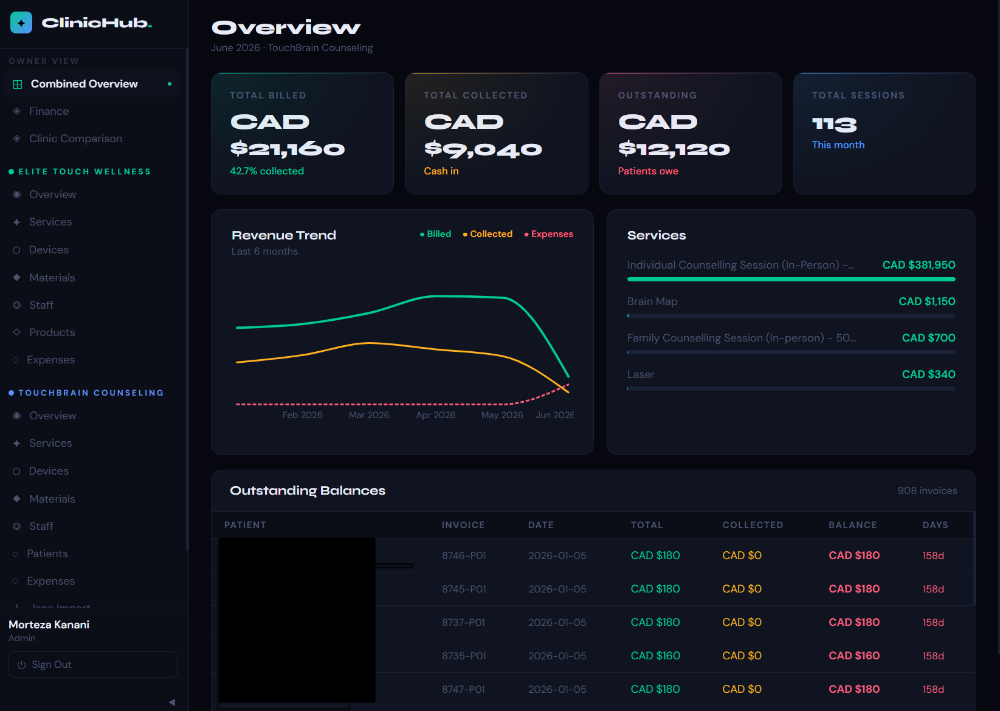
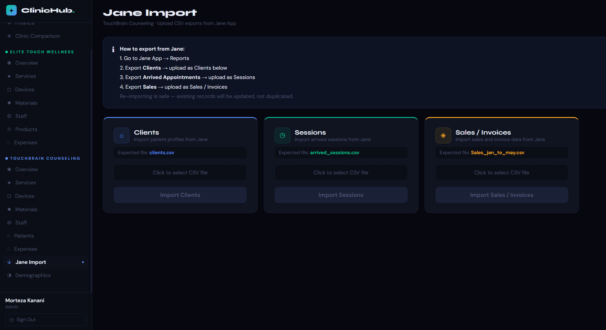
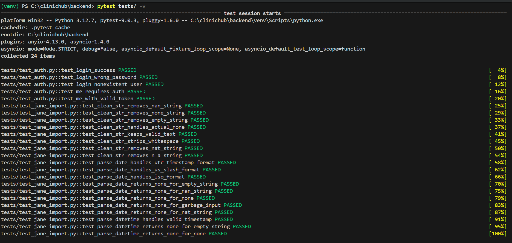
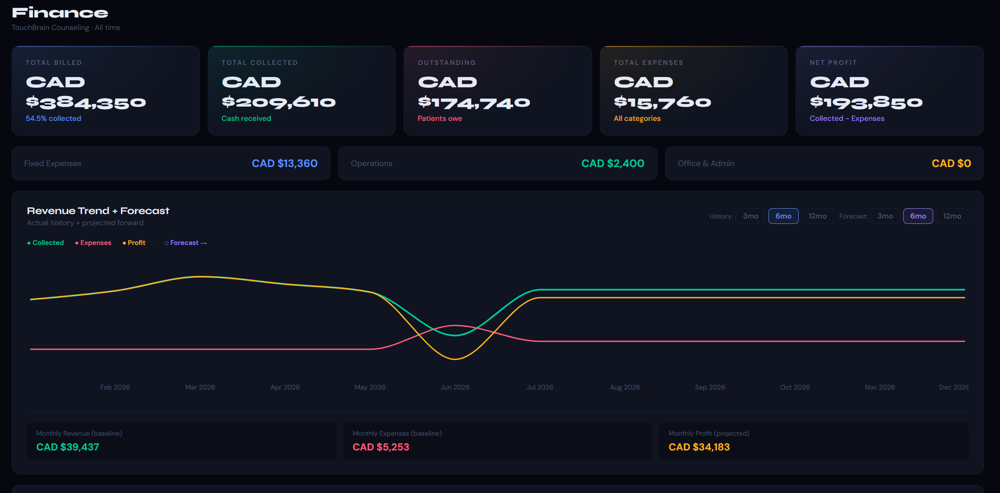
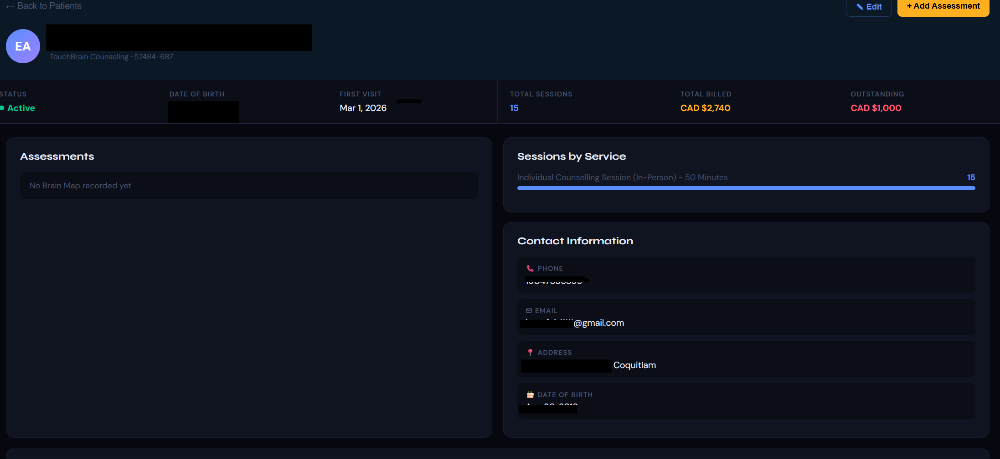

# ClinicHub — Multi-Clinic Management & BI Platform

A full-stack data platform built for a multi-location healthcare business, centered around an **ETL data pipeline** that ingests, cleans, and validates operational data from a third-party source system — backed by an automated **pytest** test suite and a CI/CD pipeline.

Built end-to-end: database design, ETL pipeline, REST API, automated tests, CI/CD, and React frontend.



---

## 🔧 Tech Stack

**Backend:** Python, FastAPI, SQLAlchemy, PostgreSQL, Alembic, JWT Auth
**Frontend:** React, Recharts
**Testing:** pytest (24 automated tests)
**CI/CD:** GitHub Actions (automated test run on every push, against a containerized PostgreSQL instance)
**Data Processing:** pandas, openpyxl

---

## 🔄 ETL Pipeline — The Core of This Project

The heart of ClinicHub is a CSV-based **Extract → Transform → Load** pipeline that ingests data exported from a third-party practice management system (Jane App) and converts it into a clean, normalized relational schema.

```
EXTRACT                    TRANSFORM                       LOAD
────────                   ──────────                      ────
Read CSV exports     →     Strip inconsistent headers  →    Upsert into PostgreSQL
(Clients, Sessions,         Normalize dates across            (create new records,
 Sales/Invoices)            multiple formats                  update existing —
                            Remove NaN/null artifacts          never duplicate)
                            Resolve foreign keys across
                            separate file exports
```

**Specific transformation challenges handled:**
- Inconsistent column naming and leading/trailing whitespace across export files
- Date parsing across multiple formats in the same column (`2024-08-27 18:30:00 UTC`, `11/8/1986`, `2024-01-15`)
- Boolean normalization (`True`/`False` strings → internal active flags)
- Null/missing-value artifacts (`"nan"`, `"NaT"`, `"n/a"`, empty strings) collapsed to a single `None` representation
- **Duplicate detection** — re-running the same import updates existing records instead of creating duplicates
- Cross-file foreign key resolution — matching patient records across three independently-exported CSVs by a shared unique identifier

**Result:** 707 patients, 2,080 sessions, and 2,081 invoices imported with zero data-integrity errors, and the pipeline is safely idempotent — it can be re-run on the same file without corrupting data.



---

## 🧪 Automated Testing — pytest

The pipeline's transformation logic is unit tested in isolation (no database or API required), alongside integration tests for the authentication API.

```bash
pytest tests/ -v
```

```
tests/test_auth.py            5 tests   — login, auth failures, token validation
tests/test_jane_import.py    19 tests   — date parsing, string cleaning, edge cases

24 passed in 3.90s
```

**Example — testing the date parser against real malformed input from the source data:**
```python
def test_parse_date_handles_utc_timestamp_format():
    result = parse_date("2024-08-27 18:30:00 UTC")
    assert result == date(2024, 8, 27)

def test_parse_date_returns_none_for_nat_string():
    assert parse_date("NaT") is None
```



---

## ⚙️ CI/CD Pipeline — GitHub Actions

Every push to `main` automatically:
1. Spins up a containerized PostgreSQL instance
2. Installs dependencies and runs Alembic migrations
3. Runs the full pytest suite against a clean database
4. Reports pass/fail status before any code is merged

This catches data-integrity regressions in the ETL logic immediately, without relying on manual test runs.

```yaml
# .github/workflows/tests.yml
services:
  postgres:
    image: postgres:15
steps:
  - run: alembic upgrade head
  - run: pytest tests/ -v
```

---

## 📊 Financial Analytics & Forecasting

Revenue trend analysis with configurable lookback windows (3/6/12 months), combined with a forward-looking forecast model based on rolling baselines.



---

## 👤 Patient Profiles — Aggregated Data View

Each patient profile aggregates session history, billing data, and assessment records — sourced from three separately-imported CSVs — into a single coherent view.



---

## 🏗️ Additional Architecture Highlights

- **Role-based access control** — JWT auth with admin/receptionist permission tiers
- **FIFO payment allocation engine** — automatically applies payments to oldest outstanding invoices
- **25-table relational schema** with Alembic migrations (infrastructure-as-code for the database)
- **Excel import pipeline** for expenses and payments with dynamic header detection

---

## 📁 Project Structure

```
backend/
  app/
    models/        # SQLAlchemy models (25 tables)
    routes/         # FastAPI route handlers
    imports/        # ETL pipeline (Jane CSV import)
    services/       # Auth, business logic
  tests/            # pytest suite (unit + integration)
  alembic/          # Database migrations

.github/workflows/  # CI/CD pipeline definition

frontend/
  src/
    pages/          # React pages (Overview, Finance, Patients, etc.)
    components/     # Shared UI components
    hooks/          # useAuth, useSort
    services/       # API client
```

---

## 🚀 Running Locally

```bash
# Backend
cd backend
pip install -r requirements.txt
uvicorn main:app --reload

# Frontend
cd frontend
npm install
npm start

# Run tests
cd backend
pytest tests/ -v
```

---

*Note: Screenshots show sample/anonymized data. Patient information has been redacted.*
